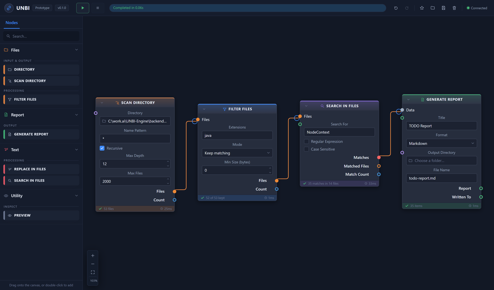

# UNBI-Engine

**U**niversal **N**ode-**B**ased **I**ntelligence Engine — a node/flow editor and execution engine
in the shape of [chaiNNer](https://github.com/chaiNNer-org/chainner), but domain-agnostic.

Spring Boot 4.1 / Java 26 backend, Angular 22 frontend, WebSocket transport. Two node packs ship:
batch **file processing** — scan a folder, filter by type, search text, replace text, write a report
— and **LLM** work against OpenRouter, llama.cpp, OmniRoute, OpenAI and Codex, with structured
output, web search, attachments, streaming and batching.



---

## Running it

Both halves need to be running. The backend serves the node catalog and executes graphs; the
frontend is the editor.

**Backend** — needs a JDK 26 on `JAVA_HOME`:

```bash
./gradlew :backend:bootRun
```

**Frontend** — needs Node 20+:

```bash
npm --prefix frontend install && npm --prefix frontend start
```

Then open <http://localhost:4200>. The status pill in the toolbar turns green when the editor has
found the engine.

To try the shipped example, press the ★ button in the toolbar: it builds a
*scan → filter → search → report* pipeline. Point **Scan Directory** at a folder — the folder button
on the field opens a browser for the machine the *engine* runs on — set a search term, and press ▶.

### Around the editor

| | |
|---|---|
| Drag from the palette, or double-click an entry | add a node |
| Drag from a port | connect — only compatible ports light up, and a wire takes its type's colour |
| Right-click | node menu (rename, save as preset, collapse, switch off, duplicate, disconnect, delete) or canvas menu |
| Double-click a node's title | give that instance a name of your own |
| The **Advanced** strip in a node | the fine tuning, folded away; the badge says how much of it you have changed |
| The 💡 in a node's header | ask the gateway whether this actually works, before running anything |
| The ✎ beside **Endpoint** | the profile dialog: where a gateway lives and how to reach it, saved on the engine and referenced by name |
| The ⤢ in the corner of a prompt box | a full-window editor, with file loading and a saved-prompt library |
| The switch in a node's footer | leave that node, and everything downstream of it, out of the run |
| `Ctrl+Enter` · `Ctrl+Z` / `Ctrl+Shift+Z` · `Ctrl+D` · `Ctrl+A` · `Del` | run · undo/redo · duplicate · select all · delete |
| Wheel, the `+`/`−` buttons, or the `%` label | zoom; the ⛶ button fits the whole graph |

### No JDK installed?

Download one — for example [Temurin 26](https://adoptium.net/) — and point `JAVA_HOME` at it.
Nothing needs to be installed system-wide: an extracted archive is enough, and Gradle itself can run
on an older JDK while the toolchain compiles against 26.

---

## Layout

```
contract/          one shared test table, read by both language implementations
backend/
  core/            pure Java: port types, graph, validation, node SPI. No Spring.
  registry/        NodeRegistry — DI-discovered node index
  engine/          scheduler, run lifecycle, cancellation
  llm/             the LLM subsystem: wire formats, credentials, pacing, templates
  nodes/           one class per node, auto-registered
  presets/         saved node configurations, stored apart from workflows
  transport/       WebSocket handler, REST catalog, JSON codecs
frontend/src/app/
  core/            type mirror, graph store + commands, catalog, presets, engine socket
  editor/          canvas, palette, toolbar
  widgets/         the input controls a node can declare
docs/ARCHITECTURE.md   the design, and why
docs/LLM-NODES.md      the LLM pack, and why it is shaped that way
```

---

## The three ideas worth knowing

**A node is one file.** A node is a `@Component` implementing `NodeDefinition` — a descriptor plus
an `execute`. Spring injects every one of them into `NodeRegistry`. There is no manifest to edit and
no registration call to forget; dropping a class onto the classpath puts it in the palette.

**The frontend has no node definitions in it.** Descriptors are served from `GET /api/catalog` and
rendered generically. Adding a node, or adding a widget to an existing one, needs no frontend
change at all — this was verified during development by adding an input to the report node and
watching it appear in the editor after a backend restart.

**One rule, two implementations, one test table.** Port compatibility is decided by
`assignable(from, to)`, which exists in Java (authoritative — it validates every graph before
running) and in TypeScript (so the editor can refuse an illegal edge during the drag, without a
round trip). Two implementations of one domain rule is the classic way behaviour drifts, so both
are held to [`contract/type-assignability.json`](contract/type-assignability.json). Add a rule?
Add rows there first; one of the two suites will go red until both agree.

---

## Tests

```bash
./gradlew :backend:test          # 365 tests
npm --prefix frontend test       # 88 tests (through the Angular test builder — `vitest` alone lacks the JIT compiler)
```

The backend suite includes an end-to-end test that boots the application, fetches the catalog over
HTTP, runs a scan → filter → search → report pipeline over a real WebSocket against a temporary
directory, and asserts the report file on disk.

---

## Node pack: batch file processing

| Node | Does |
|---|---|
| **Directory** | Names a folder once so several nodes can share it |
| **Select Files** | Picks specific files by hand, one at a time, each removable on its own |
| **Scan Directory** | Lists files, with glob, recursion, depth and count limits |
| **Filter Files** | Keeps or removes files by extension and minimum size |
| **Search In Files** | Literal or regex search, reporting line and column per hit |
| **Replace In Files** | Search and replace across many files — **dry run by default** |
| **Generate Report** | Markdown, CSV or plain text; optionally written to disk |
| **Preview** | Shows whatever is wired into it |

`Replace In Files` starts in dry-run mode deliberately. It is the only node that destroys
information, and the two outcomes are not symmetric: a needless dry run costs one click, an
unintended write costs a directory tree.

## Node pack: LLM

| Node | Does |
|---|---|
| **LLM Endpoint** | Names a saved endpoint *profile* — OpenRouter, llama.cpp, OmniRoute, OpenAI, Codex or any OpenAI-compatible gateway, with its URL, credential *name* and pacing kept on the engine. The bulb tests it. |
| **LLM Model** | Picks a model from what the endpoint serves and declares its capabilities, reasoning, pricing and provider routing. The bulb fills the rest in from the endpoint. |
| **Generation Params** | Sampling settings; anything left blank is not sent at all |
| **Variables** | Names upstream values so a prompt template can read them |
| **Prompt Template** | A prompt written once and filled in per run; save it as a preset to reuse it |
| **Prompt Variants** | Several prompts in one box, separated by `---`; wired into a prompt, each becomes its own request |
| **Attach Files** | Turns a file list into images, documents and text a model can read |
| **LLM Request** | One call — or one per item: a list on any prompt, on Data or on Attachments makes a batch, paced, in order, with failures counted |
| **Parse JSON** | Reads a JSON answer, code fence and all, optionally by path |
| **Save Result** | Writes answers to files, and hands them back to the file pack |

And in the file pack, **Load Dataset** reads a JSON, JSON Lines, CSV or plain-text file into a list
of items — one request per row, with `{{column}}` readable from the prompt.

The simplest useful workflow is three nodes: `Endpoint → Model → LLM Request`. A batch is the same
three nodes with a list wired in somewhere.

### Where the URLs and keys live

Nothing in a workflow file names a server, and nothing in the code does either. An endpoint profile
is saved on the engine under `~/.unbi-engine/profiles/llm.endpoint/`, and a workflow refers to it by
name — so the same file runs against a different server on a different machine. Keys are referred to
by name too: put one in the environment as `UNBI_LLM_KEY_<NAME>`, or add it from the profile dialog,
which writes it to `~/.unbi-engine/credentials.properties` and never reads it back.

**A credential never enters a workflow file.** The endpoint node stores a *name*; the value is
resolved at call time from the environment (`UNBI_LLM_KEY_<NAME>`), from
`~/.unbi-engine/credentials.properties`, or — for `codex` — from the credentials the `codex` CLI
already wrote. `GET /api/options` returns credential *names* only; nothing serves a value.

### Checking a configuration before you run it

Three buttons, and each one answers a question that a run would otherwise answer expensively:

- **LLM Endpoint → 💡** — is the gateway reachable, and does its credential work? It probes whatever
  that gateway can actually be authenticated against, which is not always the model listing:
  OpenRouter serves its catalogue unauthenticated, so testing there would report a revoked key as
  healthy. It reports what is left of a quota when the gateway says.
- **LLM Model → 🔍 and 💡** — list what the endpoint serves, then confirm one model and *fill this
  node in from it*: capabilities, context window, output ceiling, price, reasoning dialect and
  effort tiers. Everything it writes is one `Ctrl+Z` away, and anything the gateway did not mention
  is left exactly as you had it.
- **LLM Request → 💡** — would this request be honoured? It runs the real capability check against
  the real model and confirms the model is still served, which is worth a second before a batch of
  four hundred.

Discovery also feeds the rest of the editor. Once a model declares its capabilities, the Response
Format dropdown on **LLM Request** offers only the formats that model supports — with no button to
press, because it is a rule the descriptor carries rather than a lookup the editor performs.

### Gateways, presets and prompts

A **gateway** is the dropdown at the top of the Endpoint node: a set of known defaults for
OpenRouter, llama.cpp, OmniRoute, OpenAI or Codex. Picking one fills in every field you left blank
and nothing you did not. It is the only thing "from gateway" ever refers to.

A **preset** is the thing you make: right-click any configured node → *Save as preset*, and it is
stored on the engine, apart from any workflow, and listed in the palette's Presets tab for every
graph you build afterwards. Drag one onto a canvas to get that node already configured; hover a row
and press the bin to delete it. Saving over the same name for the same node type updates it.

A **saved prompt** is a preset too, and deliberately: the full-window editor behind the ⤢ on any
prompt box can load a draft from a file, save the text under a name, and search everything saved
before. What it writes is a Prompt Template preset — so it shows up in the Presets tab, in every
other prompt editor, and can be dropped onto a canvas as a node. One store, nothing to keep in sync.

**Nodes stay small.** Anything a node's author marked as fine tuning lives behind an **Advanced**
strip, whose badge says how many of those settings you have moved away from their default; anything
that cannot currently apply — a JSON schema box above a response format of *Text* — is not drawn at
all; and a node with more in it than fits scrolls inside its own frame rather than growing past the
edge of the canvas.

See [docs/LLM-NODES.md](docs/LLM-NODES.md) for the design and the provider-specific reasoning behind
it.

---

## Status

A first prototype. Working and verified end to end, with real limits — see
[the architecture notes](docs/ARCHITECTURE.md#8-deliberately-not-in-v1) for what was deliberately
left out and where the seams for it are.
