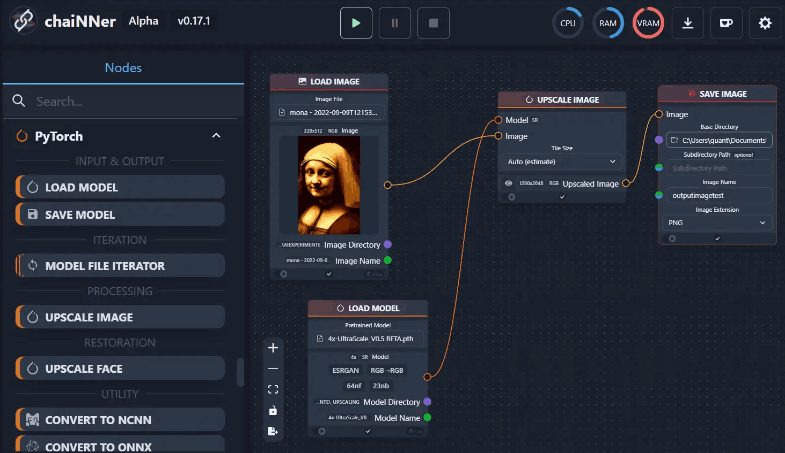
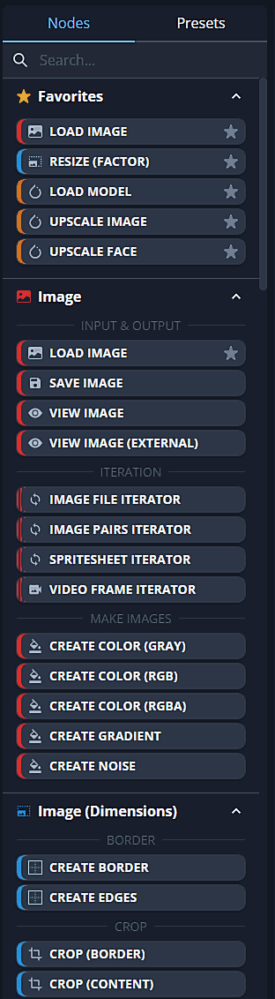
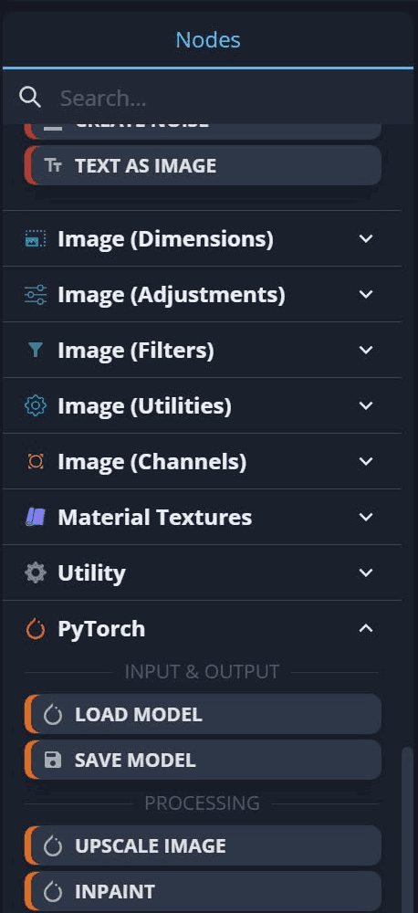
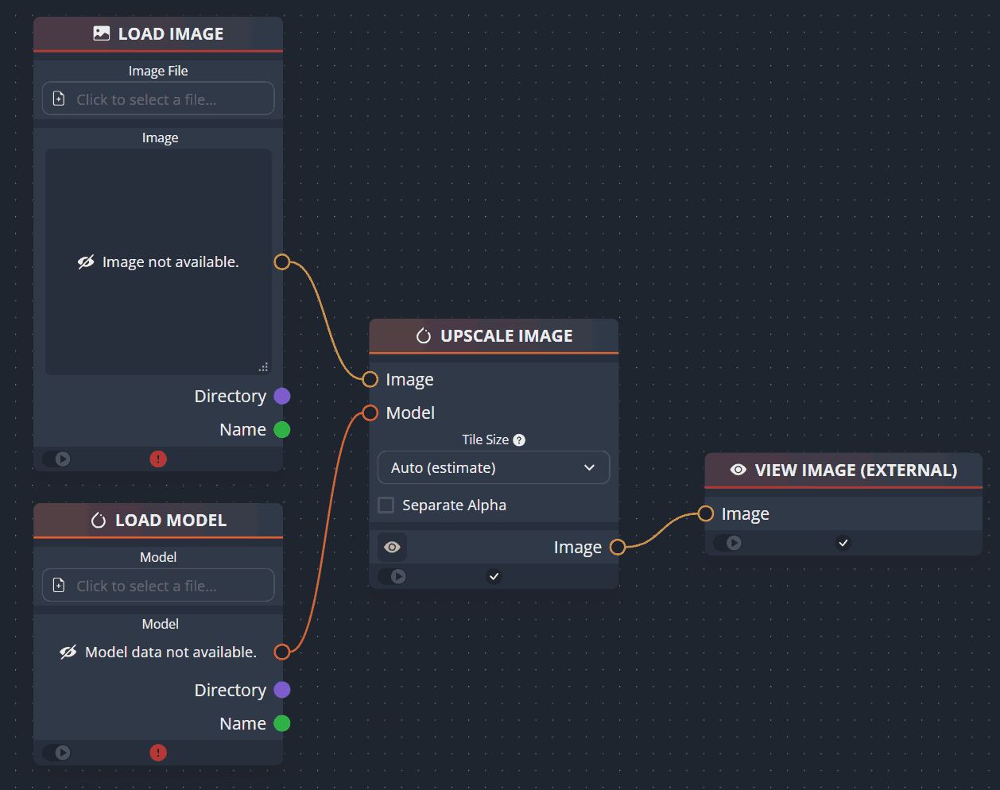
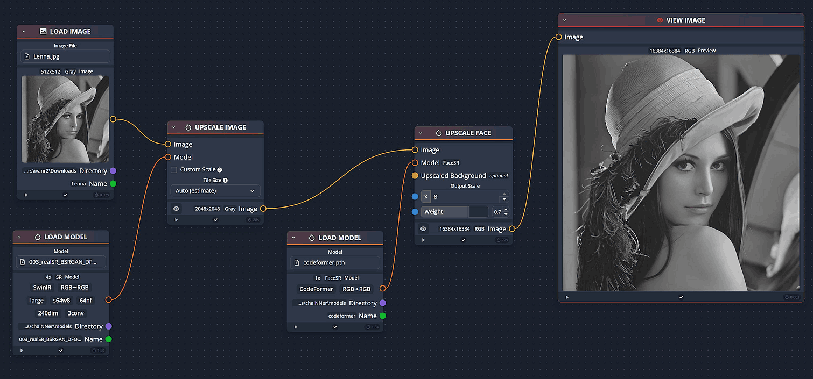
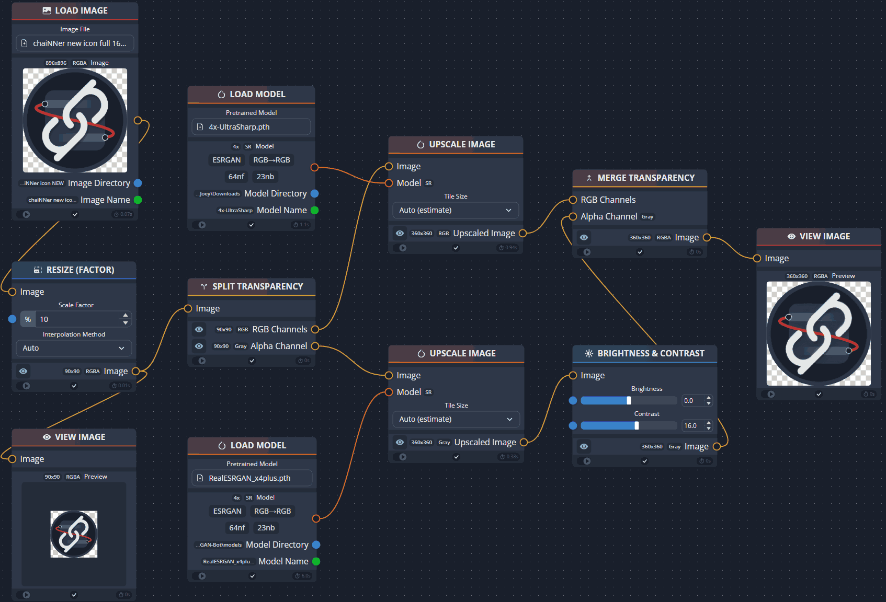
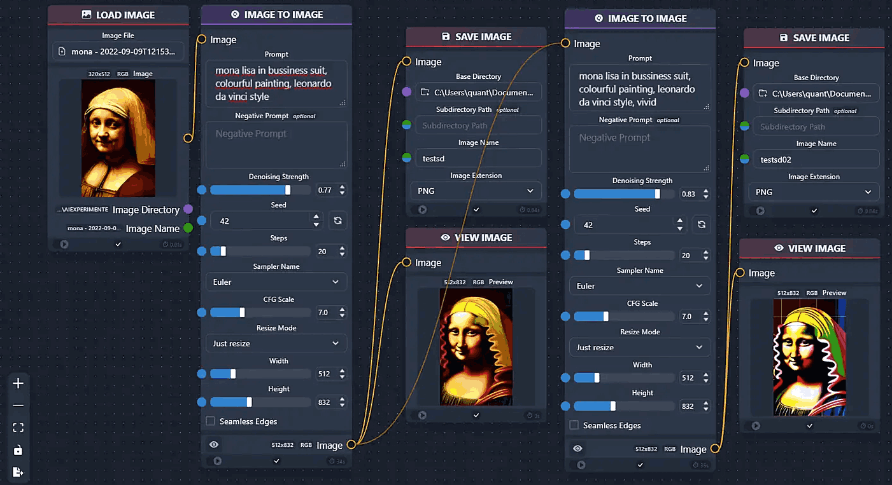

# Main GOAL: create a client-server app for a Universal Node and flow based engine like ComfyUI but for universal tasks

create a chaiNNer like ('https://github.com/chaiNNer-org/chainner') app: node and flow based editor / engine, but with broader and more general universal tasks processing.

ChaiNNer app is a image processing tool written in react, this app should be a universal client-server tool for a wide range of tasks, but with a similar visual style.
It must be as flexible, well-designed and scalable suitable for a wide range of tasks, but which adopts a similar approach to workflow design.
Try to make it as well-designed as possible, easily expandable, using DI, OPP and Signals + RxJS in frontend and modern spring / springboot with java 26 with websocket transport layer as backend.
Each Node must be automatically registered = automatically indexed and pluggable. 
They should not be in a single file, but each in its own separate file or class containing a system for checking inputs, outputs and connections between nodes, as well as compatibility checks, configuration, status and progress check / quering, etc.
The application and API itself must be very well thought out and structured from an architectural point of view, extendable, well-readable, every functionality should be pluggable (everything is plugin or extension), but without over-engineering = simply designed with great potential for scalability and flexibility. 
Try to avoid long, convoluted classes and utilize the principles of OOP, dependency injection, reactivity, streams, events, etc., to the full. In short, the best architectural principles and approaches for this type of task.
A UI framework, a graph editor library and a workflow execution engine should be very well designed with great node extensibility.

Visually, try to achieve the greatest possible similarity with chainner and create a truly attractive, modern, user-friendly and well-designed UI with animations, drag and drop, a carefully considered colour scheme, effects and visual style, and an convenient, well-designed editor and layout. Don't use default design of selected flow engine library, but fine-tune improve and adapt it to closely match the proposed visual style and design

Add to the first version: nodes for batch processing of files, for example nodes to scan every file in directory, not to filter special type of files, node to search text in files, node to search and replace text in files and node for generating processing/output report. It will be a first use-case.

The overall visual style should be in line with chainner app:

The frontend ui part consists of three parts:
- bottom menu

- left panel bar

- main workflow area

## Technology Stack:
Build automation tool: Gradle
Backend: modern Spring Boot app with Java 26
Frontend: Node/NodeJS + Angular (>= 22.1.0) with RxJS, SCSS, websockets

Flow engine (critically evaluate and select best-one):
ngx-vflow (signals-native), Rete.js v2 + Angular renderer, Foblex Flow

Further considerations and thoughts on implementation see: '\angular.md' markdown document.

